## 一、系统需求分析

### 1.1可行性分析

要成功地实现一个项目，首先应该进行功能上的需求分析，这样才能令设计出的项目满足用户的各项功能需求。可行性分析也称为可行性研究，是在项目调查的基础上，针对新项目的开发是否具备必要性和可能性，对新项目的开发从技术、经济、社会的方面进行分析和研究，以避免投资失误，保证新项目的开发成功。

**市场可行性:**
在当前数字化时代，广告服务平台具备良好的市场前景。随着网络用户数量不断增长，广告服务平台能够为企业提供高度定制化、针对性强的广告推广方案，帮助企业提高品牌知名度和销售额。此外，广告服务平台还可以通过数据分析服务，为企业提供更加精准的广告效果分析，提升广告投放的效率和收益。因此，广告服务平台在数字化市场中具备广阔的市场前景和商业价值，也方便了我们流量应用平台的变现。

**技术可行性:**
广告服务平台的开发需要具备先进的技术支持，包括html、css、javascript、mysql、Java、ssm框架等领域。其中，数据分析技术的应用尤为关键。数据分析技术可以帮助平台对广告效果进行准确分析和预测，从而优化广告投放策略，实现对用户行为和偏好的智能分析和推断。此外，广告服务平台还需要具备可靠的数据安全保障和稳定的技术架构，以确保广告投放的稳定性和可靠性。综上，广告服务平台的开发需要具备丰富的技术经验和技术储备，并且需要持续进行技术创新和升级。

### 1.2项目要解决的问题

1. 广告效果评估问题：企业需要了解广告投放的效果，进行实时的监控和优化，以提高广告投放的效果和ROI。但是传统的广告投放方式通常缺乏实时的监控和反馈机制，企业很难及时调整广告投放策略。
2. 广告投放管理问题：广告服务平台需要提供广告投放管理功能，包括广告创意制作、广告投放时间、投放渠道、投放地域等设置，以及广告预算控制等管理功能。
3. 广告数据安全问题：广告服务平台需要保障广告数据的安全，包括广告主信息、广告创意等数据的保护，以及广告投放数据的隐私保护等。
4. 广告主客服服务问题：广告服务平台需要提供广告主客服服务，解答广告投放过程中的疑问，解决问题，提高广告主的满意度。
5. 网站的广告收益管理问题：我们需要管理自己的广告资源，通过对广告位的管理和优化，提高广告收益。但是传统的广告投放方式往往缺乏灵活的广告位管理和优化机制，导致媒体的广告收益不尽如人意。

### 1.3项目目标

1. 提高广告平台效率：广告服务平台需要解决广告投放效率低下的问题，因此项目的目标可能是提高广告平台的效率，让广告投放更加高效，提高广告主的转化率和回报率。
2. 提高用户体验：广告服务平台需要解决广告过于烦扰用户的问题，因此项目的目标可能是提高广告的质量，让广告更加符合用户的需求，提高用户的满意度。
3. 提高广告数据精准度：广告服务平台需要解决广告数据精准度不高的问题，因此项目的目标可能是提高广告数据的精准度，通过更加精准的广告数据来提高广告平台的效率和用户体验。
4. 提高广告平台安全性：广告服务平台需要解决广告欺诈等问题，因此项目的目标可能是提高广告平台的安全性，保证广告数据的真实性和广告投放的合法性，提高广告平台的信誉度和安全性。

## 二、功能设计

### 2.1功能划分

该项目包含以下五个功能模块：

1. 用户认证
2. 主页功能
3. 广告服务
4. 支付服务
5. 用户帮助

### 2.2功能描述

项目为认证登录的用户提供广告服务、支付服务，并且要完成主页的一般功能和必要的用户帮助文档。

#### 2.2.1用户认证

##### 2.2.1.a用户注册

用户点击登录页的“注册”/“开始推广”按钮，重定向至注册页面，包含邮箱/密码/确认密码/验证码的输入和确认注册的按钮，用户依次输入上述内容（要求内容合法），然后点击注册，然后重定向至登录页/主页（待定），从而成功注册帐户。

##### 2.2.1.b用户登录

用户点击“用户名/邮箱”输入框，输入自己的邮箱（要求展示输入），接着点击“密码”输入框，输入自己的密码（要求*星号替代输入），点击“登录”按钮登录。

##### 2.2.1.c更改密码

用户在主页点击“账号管理”，而后重定向至账号管理页面。在页面中有只读的文本框展示用户的用户名、邮箱，用户名的文本框右侧有“编辑”icon按钮，点击后可以对用户名进行更改。邮箱文本框下方的“更改邮箱”，则可以对邮箱进行更改：先给原邮箱发送验证码，然后输入验证码，然后输入新邮箱，点击“完成更改”，弹出“更改成功”。点击密码title右侧的“更改密码”按钮，则可以对密码进行更改：先输入原密码，然后输入新密码，再次输入确认新密码，点击“完成更改”，成功更改密码。

##### 2.2.1.d其他

1.用户可以点击“眼睛”按钮显示输入的密码（视进度待定）
2.用户可以勾选“记住我”选项，通过cookie使用户下次进入登录页时自动转入主页（视进度待定）
3.多次登录失败（密码/邮箱错误）后，用户需要额外输入验证码（视进度待定）

#### 2.2.2主页功能

##### 2.2.2.a重定向

给用户展示购买推广，管理推广，财务管理，账号管理，使用帮助等标签，用户点击后进入相应标签页具体操作，点击logo返回主页，点击头像进入账号设置……

##### 2.2.2.b展示

滚动图片栏，图片滚动（包含帮助文档、QA、团队介绍等重定向内容）

#### 2.2.3广告服务

##### 2.2.3.a购买服务

套餐展示页（商品页）给用户展示预设套餐及其简要内容，以及自定义套餐选择，用户点击套餐可以查看套餐详情或自定义套餐。选择好套餐后，点击“确认”按钮，重定向至广告提交页面，需要填写推广标题、推广文案以及需要进行推广的广告海报，然后提交推广商单请求。若帐户余额不够，则点击“提交”后弹窗提示“余额不足”，选择“取消”按钮关闭弹窗，选择“去充值”按钮则重定向至充值页面。
管理员可以点击编辑套餐的文字选项。

##### 2.2.3.b推广审核

管理员从首页进入“推广管理”，推广管理界面是企业提交的推广栏目列表，包含推广的基本信息（企业、提交时间、海报、标题），点击列表中的推广栏目可以重定向至推广详情页，查看该推广服务商单的详情。点击“通过”button，弹出“确认通过”弹窗，点击“确认”button通过推广，点击“取消”button关闭弹窗。点击“拒绝”button，弹出title为“反馈”的弹窗，其中带有文本框，输入文本并点击“提交”button，拒绝推广商单并反馈给客户。

##### 2.2.3.c推广详情

企业客户通过主页中的“我的服务”进入广告详情页，详细查看广告情况，除广告本身内容外，还包括展示数量、展示时间、已支出费用（以及点击量），尽量以图表形式展现。

##### 2.2.3.d推广管理

企业客户通过主页中的“我的服务”进入广告详情页，除详细查看广告情况外，企业客户还可以通过点击按钮“续费”重定向至支付界面，或点击“终止”，然后弹出确认终止的弹窗，输入密码后终止广告服务。

#### 2.2.4财务管理

##### 2.2.4.a支付预存

用户通过点击主页的“财务管理”按钮，重定向至财务页，点击“预存”按钮，重定向至预存页，选择支付渠道，扫码付款以预存广告费用。

##### 2.2.4.b账户流水

用户通过点击主页的“财务管理”按钮，重定向至财务页，可以在这里查看自己帐户的流水和余额。

##### 2.2.4.c余额提现

企业用户通过点击主页的“财务管理”按钮，重定向至财务页，在财务页点击“提取余额”按钮，弹出至“确认”弹窗，点击“确认”即提交提现申请。而后余额旁显示“资金处理中”，点击“资金处理中”可重定向至详情页，包含最晚到账时间以及订单号、提款金额等信息，以及“联系我们”按钮，点击联系我们按钮重定向至联络页（后续issue实现联络页）

管理员通过点击首页“待审核”重定向至审核页，点击“提现审核”，进入提现审核页，可以看到待通过的提款请求栏中的提款请求，其中包含提款的金额和发起时间，点击请求后面的“通过”按钮，弹出确认弹窗，点击“确认按钮”，通过提款。

#### 2.2.5帮助文档

##### 2.2.5.a教程帮助

企业用户可以在主页点击“帮助指南”重定向至帮助页，在帮助页里可以查看“用户协议”、“帮助文档”和“Q&A”文档，点击后可以打开详情页，分别查看用户协议的内容、如何使用互联网广告系统、使用时可能出现的问题及其解决办

##### 2.2.5.b反馈问题

在主页/头像/资金页/帮助页点击“联系我们”或“反馈”按钮，即可重定向至联络页，然后可以在文本框分别填写自己的邮箱/联络方式、反馈意见，选择反馈类型，然后提交反馈。

## 三、 系统分析

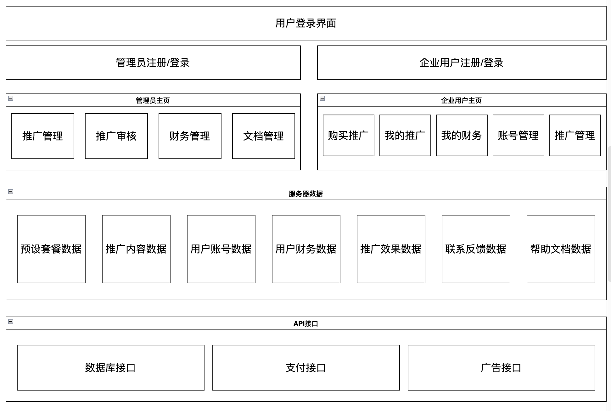

## 四、基本接口

### 4.1广告信息

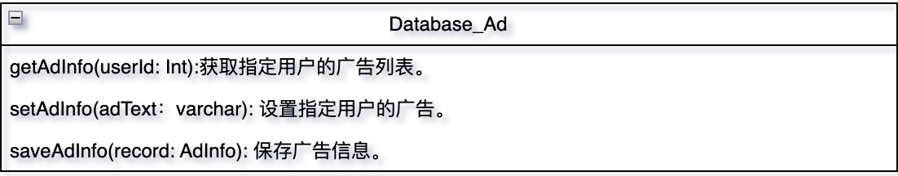

- `getAdInfo(userId: Int)`:获取指定用户的广告列表。
- `setAdInfo(adText：varchar)`: 设置指定用户的广告。
- `saveAdInfo(record: AdInfo)`: 保存广告信息。

### 4.2用户信息

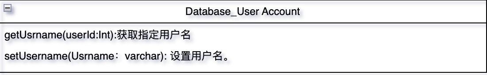

- `getUsrname(userId:Int)`:获取指定用户名.
- `setUsername(Usrname：varchar)`: 设置用户名。

### 4.3支付接口

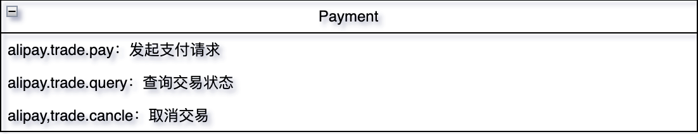

- `alipay.trade.pay`：发起支付请求
- `alipay.trade.query`：查询交易状态
- `alipay,trade.cancle`：取消交易

### 4.4展示接口

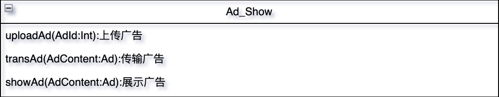

- `uploadAd(AdId:Int)`:上传广告
- `transAd(AdContent:Ad)`:传输广告
- `showAd(AdContent:Ad)`:展示广告

## 五、 系统流程分析

### 5.1企业用户

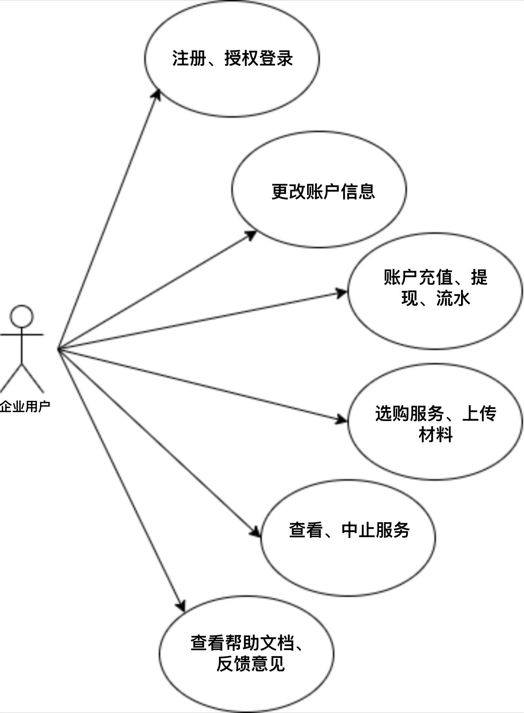

### 5.2管理员

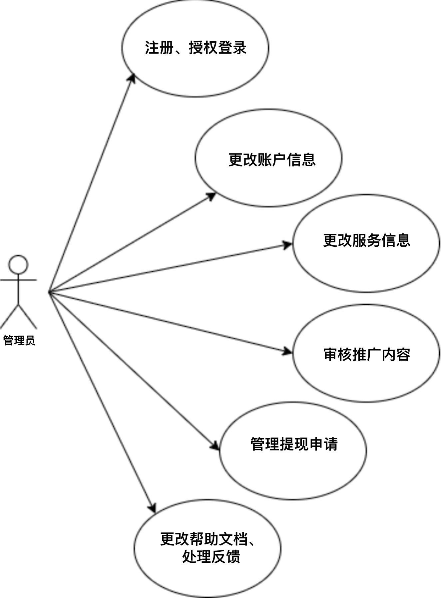

## 六、功能时序图

### 6.1用户注册

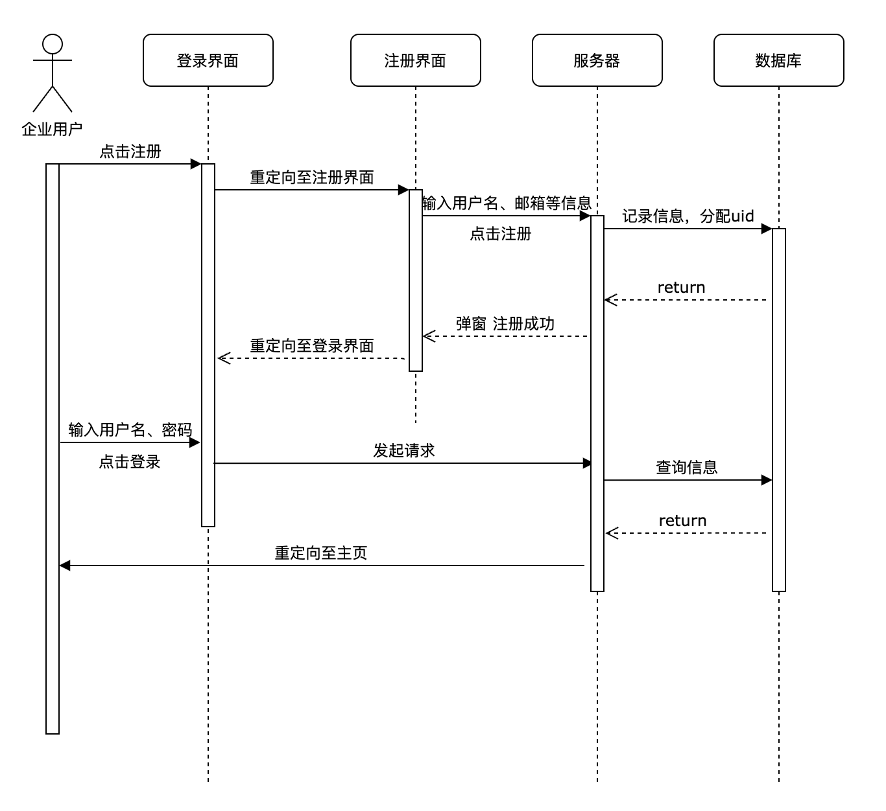

### 6.2购买服务

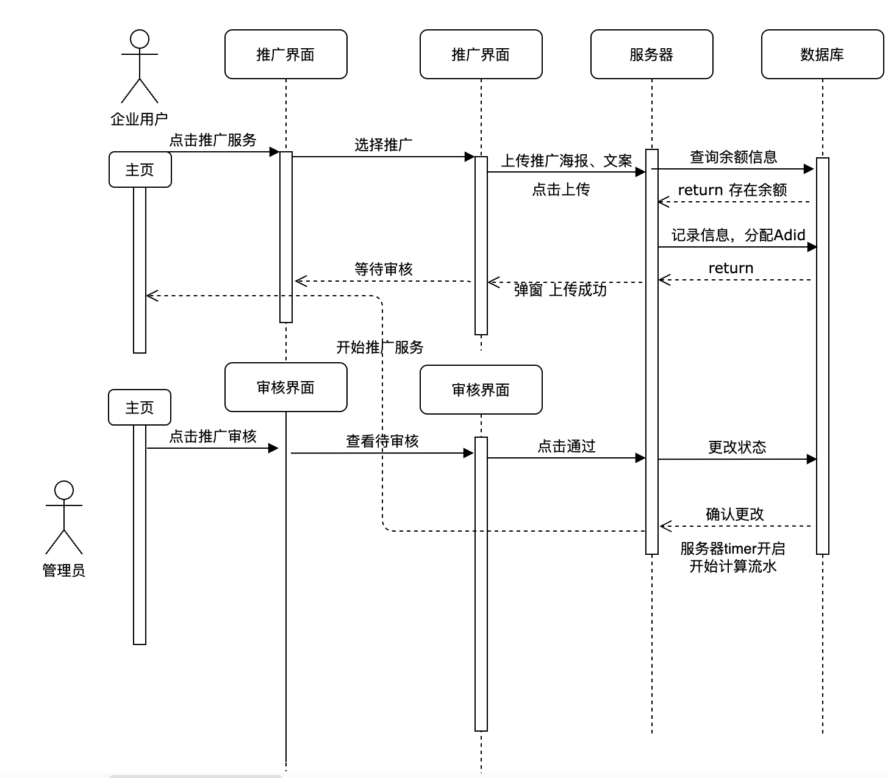

### 6.3服务详情

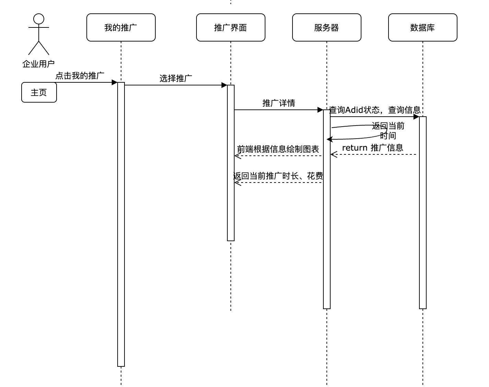

### 6.4终止服务

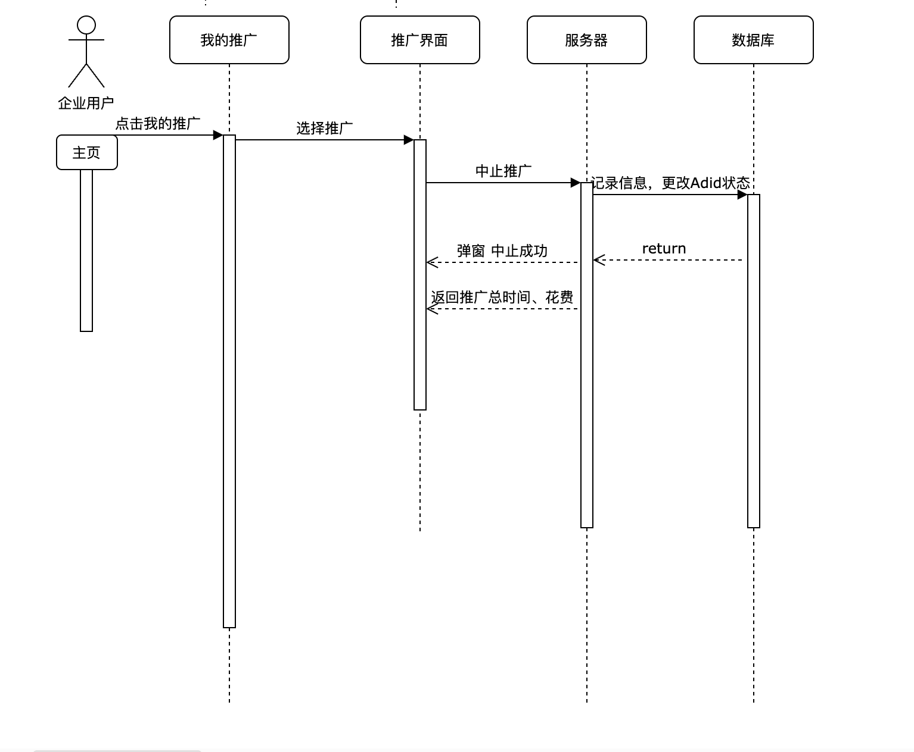

### 6.5支付服务

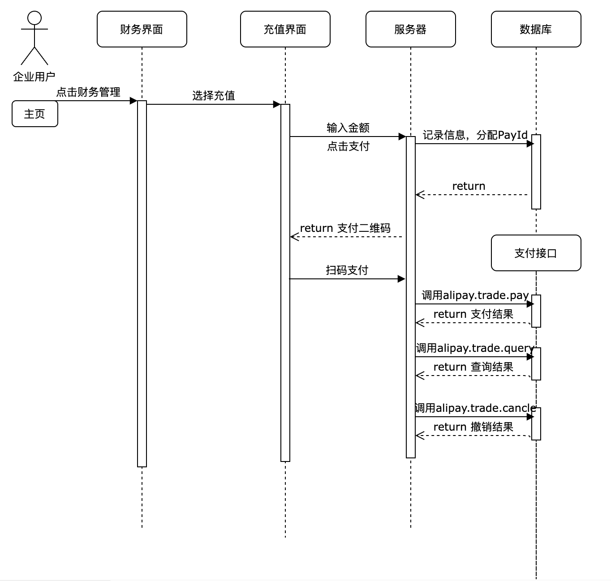

## 七、数据库设计

### 7.1用户基本信息

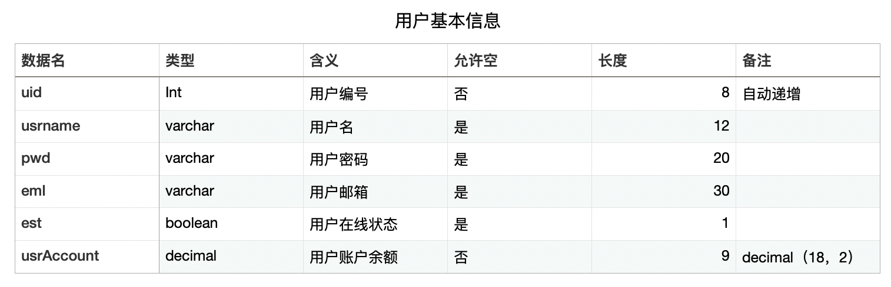

### 7.2管理员基本信息

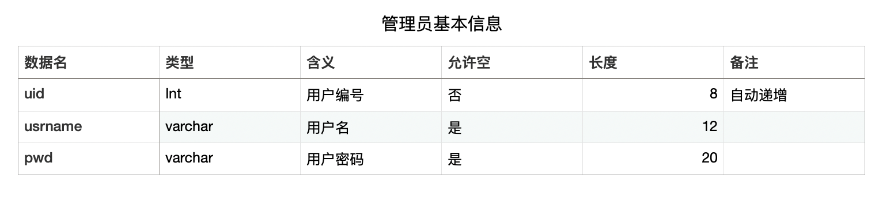

### 7.3用户反馈信息

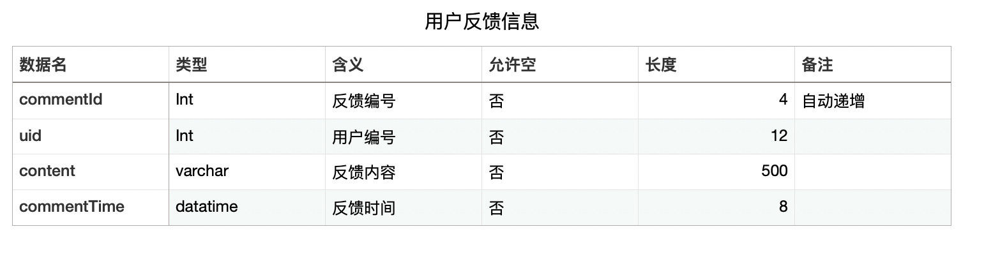

### 7.4广告交易信息

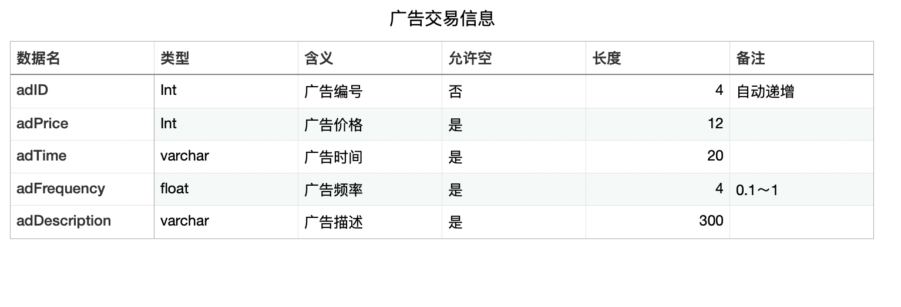

### 7.5广告服务信息

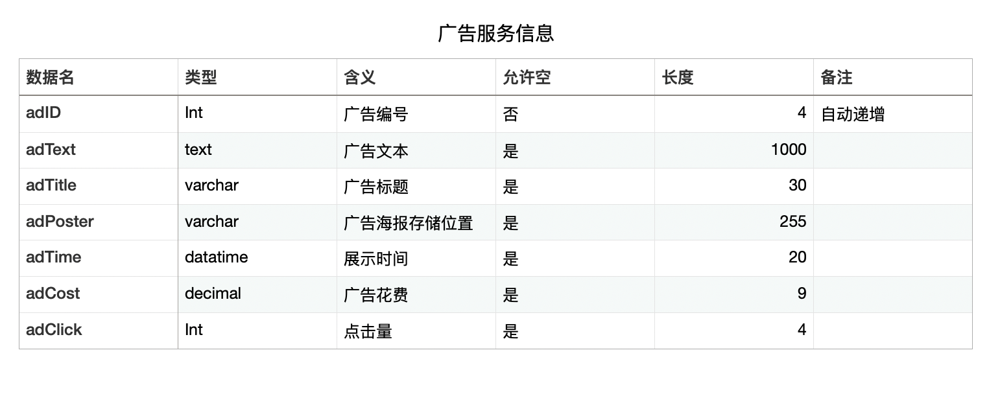

### 7.6支付信息

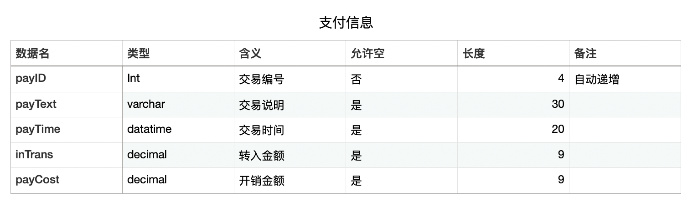

### 7.7帮助文档

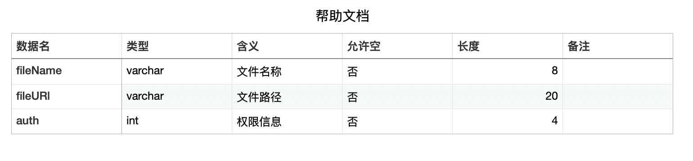

## 八、开发环境

### 8.1开发工具

我们知道数据库以共强大的操作和管理功能成为高速信息表达的途经。据我所知，数据库的类型有很多，然而本项目选择了用phpMyAdmin来作为数据库软件。

用它作为数据库的理由为: phpMyAdmin能够满足今天的商业环境要来不同类型的数据库解决方案，包含了非需丰富的新特性:通过提供一个更安全、 可靠和高效的数据管理平台，增强企业组织中用户的管理能力，大幅提高管理效率，降低运维风险和成本:通过提供先进的商业智能平台满定众多客户对业务的实时统计分析、监控预测等多种复杂管理需求，推动企业管理信息化建设制业务发展。同时，phpMyAdmin将提供一个极具扩展性和灵话性的开发平台，不断拓展您的应用空间，实观数据业务互联.为您带来新的商业应用机遇。由于大减少了应用程序宕机时间，提高了系统的可伸输性和性能，井加以更严格的安全控制。phpMyAdmin在支持现实中最苛制的企业级系统要求的道路上，迈出了极大的一步。

### 8.2结构：三层架构

网站结构分为三个逻辑层:

web层：它为客户端提供对应用程序的访间，它由Web窗体和代码隐藏文件组成。

业务理辑层：业务逻辑层主要负责对数据层的操作。也就是说把-一些数据层的操作进行组合. .可以通过编程来实现对数据库的访间，最终得到想要的结果。

数据访问层：数据访问层主要是对原始数据(数据库或者文本文件等存放数据的形式)的操作层，具体为业务逻辑层或表示层提供数据服务。
